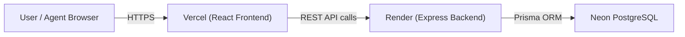
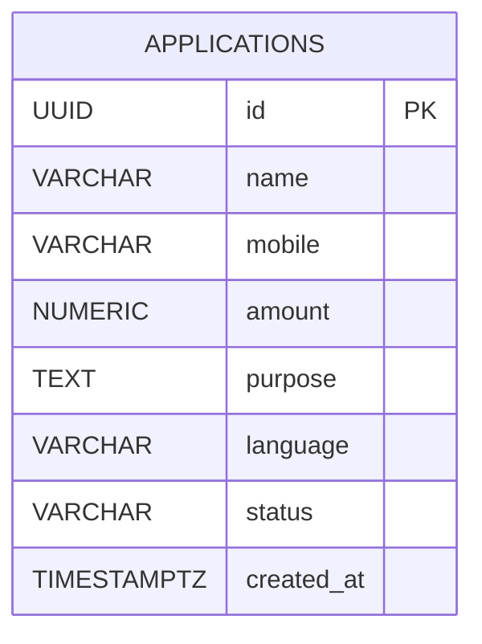
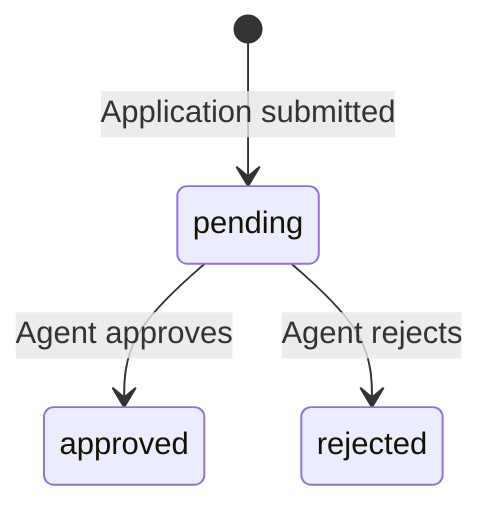

# Vitto : Loan Application Portal

A full-stack loan application portal built for Vitto's field operations team. Agents can submit borrower loan applications in multiple Indian regional languages, track them on a live dashboard, and approve or reject them in real time.

**Live Frontend:** https://vitto-portal.vercel.app  
**Backend API:** https://vitto-portal.onrender.com  
**GitHub:** https://github.com/KavyaKapoor420/Vitto-portal

---

## Screenshots
## Screenshots

| | |
|---|---|
|  |  |
|  |  |


---


## Architecture



---

## Database Schema



**Status flow:**



---

## REST API Endpoints

| Method | Endpoint | Description | Status Codes |
|---|---|---|---|
| `POST` | `/api/applications` | Submit a new loan application | `201` success, `400` validation error |
| `GET` | `/api/applications` | Get all applications, newest first | `200` |
| `GET` | `/api/applications?status=pending` | Filter by status (pending / approved / rejected) | `200`, `400` invalid status |
| `GET` | `/api/applications?search=Ravi` | Search by name or mobile | `200` |
| `PATCH` | `/api/applications/:id/status` | Update status to approved or rejected | `200`, `400`, `404` |
| `GET` | `/api/summary` | Dashboard stats — totals and counts per status | `200` |

### POST /api/applications — Request Body

```json
{
  "name": "Ravi Kumar",
  "mobile": "9876543210",
  "amount": 25000,
  "purpose": "Small business",
  "language": "Hindi"
}
```

`language` must be one of: `Hindi`, `Tamil`, `Telugu`, `Marathi`, `English`

### Validation Error Response (400)

```json
{
  "error": "Validation failed",
  "details": ["mobile must be exactly 10 digits"]
}
```

---


## Features

- Submit loan applications with name, mobile, amount, purpose and preferred language
- Dashboard with live stats bar showing total applications, total amount, pending and approved counts
- Filter applications by status and search by name or mobile number
- Inline status update — approve or reject from the dashboard without a page reload
- Language badge colour coding — each language has a distinct colour for quick scanning
- Fully responsive layout for mobile and desktop
- Light and dark mode with preference saved to localStorage
- Server-side and client-side validation with clear error messages
- All database credentials stored in environment variables, never in code

---


## Local Setup

### Prerequisites

- Node.js v18+
- A [Neon](https://neon.tech) free PostgreSQL database
- Git

---

### 1. Clone the repository

```bash
git clone https://github.com/KavyaKapoor420/Vitto-portal.git
cd Vitto-portal
```

---

### 2. Backend setup

```bash
cd backend
npm install
```

Create a `.env` file in the `backend/` folder:

```env
DATABASE_URL="postgresql://your_neon_connection_string?sslmode=require"
PORT=3001
```

Run the Prisma migration to create the database table:

```bash
npx prisma migrate dev --name init
npx prisma generate
```

Start the backend server:

```bash
npm run dev
```

Backend runs at `http://localhost:3001`

---

### 3. Frontend setup

Open a new terminal:

```bash
cd frontend
npm install
```

Create a `.env.local` file in the `frontend/` folder:

```env
VITE_API_URL=http://localhost:3001/api
```

Start the frontend:

```bash
npm run dev
```

Frontend runs at `http://localhost:5173`

---

### 4. Test the API

```bash
# Submit an application
curl -X POST http://localhost:3001/api/applications \
  -H "Content-Type: application/json" \
  -d '{"name":"Ravi Kumar","mobile":"9876543210","amount":25000,"purpose":"Small business","language":"Hindi"}'

# Get all applications
curl http://localhost:3001/api/applications

# Get summary stats
curl http://localhost:3001/api/summary

# Update status (replace UUID with real id from POST response)
curl -X PATCH http://localhost:3001/api/applications/YOUR-UUID/status \
  -H "Content-Type: application/json" \
  -d '{"status":"approved"}'
```

---


## Tech Stack

| Layer | Technology |
|---|---|
| Frontend | React.js (Vite), Tailwind CSS |
| Backend | Node.js, Express.js |
| ORM | Prisma |
| Database | PostgreSQL (Neon free tier) |
| Deployment | Vercel (frontend), Render (backend) |

---

## Project Structure

```
vitto-portal/
├── backend/
│   ├── prisma/
│   │   ├── schema.prisma          # DB schema + enums
│   │   └── migrations/            # Auto-generated migration SQL
│   ├── src/
│   │   ├── routes/
│   │   │   ├── applications.js    # POST, GET, PATCH endpoints
│   │   │   └── summary.js         # GET /api/summary
│   │   ├── validate.js            # Input validation helper
│   │   ├── prisma.js              # Shared Prisma client
│   │   └── app.js                 # Express app setup
│   ├── server.js                  # Entry point
│   └── .env                       # DATABASE_URL, PORT (never committed)
│
└── frontend/
    ├── src/
    │   ├── pages/
    │   │   ├── HomePage.jsx       # Landing page
    │   │   ├── ApplyPage.jsx      # Loan application form
    │   │   └── DashboardPage.jsx  # Applications table + stats
    │   ├── components/
    │   │   └── Navbar.jsx         # Nav with dark mode toggle
    │   ├── hooks/
    │   │   └── useDarkMode.js     # Dark/light mode with localStorage
    │   ├── lib/
    │   │   └── api.js             # All fetch calls in one place
    │   ├── App.jsx                # React Router setup
    │   └── index.css              # Global styles, CSS variables
    └── vite.config.js             # Dev proxy /api → localhost:3001
```

---

## Deployment

| Service | Purpose | Config |
|---|---|---|
| Render | Backend (Node.js) | Set `DATABASE_URL` in environment variables |
| Vercel | Frontend (React) | Set `VITE_API_URL=https://vitto-portal.onrender.com/api` |
| Neon | PostgreSQL database | Free tier, connection string in `DATABASE_URL` |

---

## Known Issues

- Render free tier spins down after inactivity — the first API request after idle may take 30 to 60 seconds to respond. Subsequent requests are fast.

---

## What I Would Improve

- Add pagination to the dashboard table for large datasets
- Add JWT authentication so only authorised agents can update statuses
- Write unit tests for the validation logic and API endpoints
- Add an audit log to track who changed which application status and when
